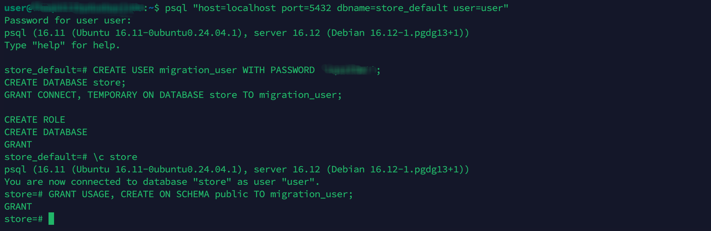
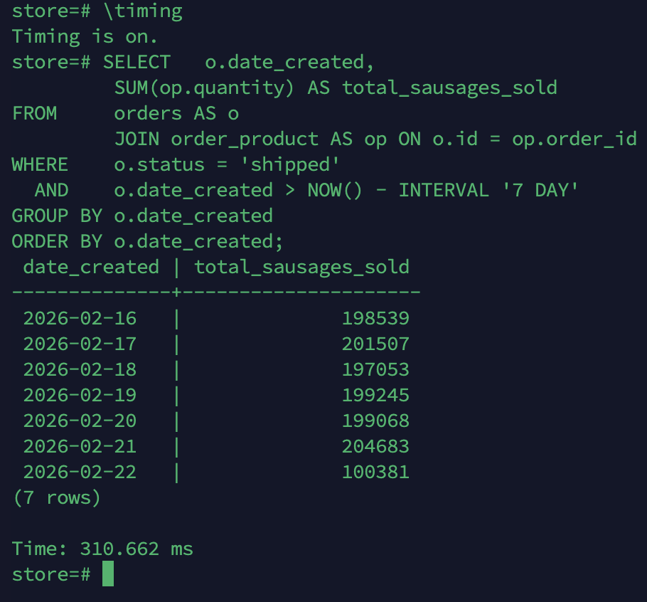
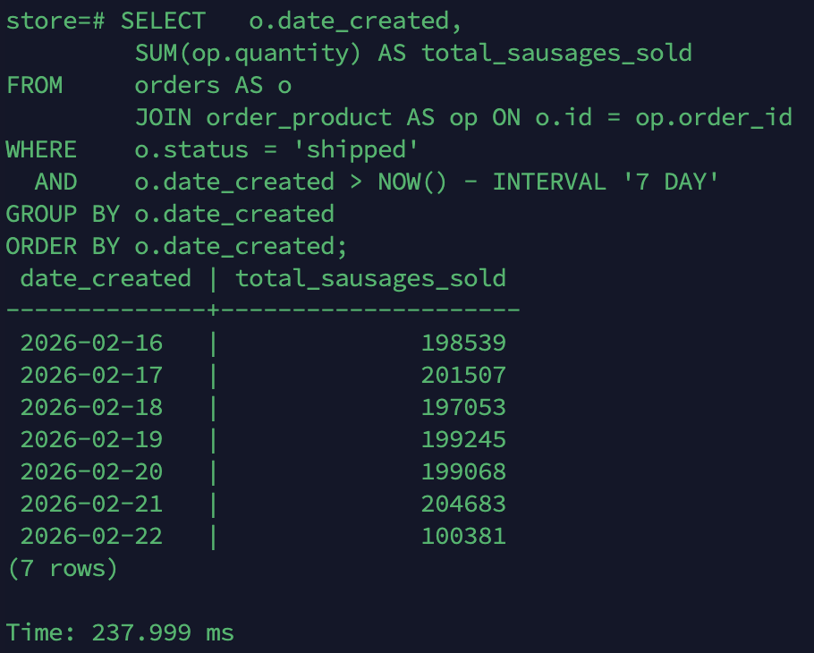

# DBOps project

Репозиторий содержит Flyway-миграции для БД `store` и workflow для прогона миграций + автотестов.

## Структура

```text
migrations/
  V001__create_tables.sql
  V002__change_schema.sql
  V003__insert_data.sql
  V004__create_index.sql
.github/workflows/main.yml
```

## GitHub Secrets

В настройках репозитория необходимо добавить secrets:

* `DB_HOST` - хост PostgreSQL
* `DB_PORT` - обычно `5432`
* `DB_NAME` - `store`
* `DB_USER` - пользователь для миграций (например `migration_user`)
* `DB_PASSWORD` - пароль пользователя

Workflow использует эти значения для подключения и выполнения Flyway.

---

## Создание БД и пользователя

Перед началом миграций необходимо подключиться к PostgreSQL и выполнить:

```sql
CREATE USER migration_user WITH PASSWORD '<Very_Strong_Password>';

CREATE DATABASE store;

GRANT CONNECT, TEMPORARY ON DATABASE store TO migration_user;

\c store

GRANT USAGE, CREATE ON SCHEMA public TO migration_user;
```



---

## Миграции Flyway

| Файл                      | Описание                                                                                                      |
|---------------------------|---------------------------------------------------------------------------------------------------------------|
| `V001__create_tables.sql` | Создание исходной структуры (5 таблиц)                                                                        |
| `V002__change_schema.sql` | Нормализация схемы: добавление полей `price` и `date_created`, удаление таблиц `product_info` и `orders_date` |
| `V003__insert_data.sql`   | Заполнение таблиц тестовыми данными                                                                           |
| `V004__create_index.sql`  | Создание индексов для оптимизации запросов                                                                    |

---


## Сравнение производительности до и после добавления индексов

Условие: учитывать только заказы со статусом `shipped`.

Необходимо выполнить данный запрос:

```sql
SELECT o.date_created,
       SUM(op.quantity) AS total_sausages_sold
FROM orders AS o
         JOIN order_product AS op ON o.id = op.order_id
WHERE o.status = 'shipped'
  AND o.date_created > NOW() - INTERVAL '7 DAY'
GROUP BY o.date_created
ORDER BY o.date_created;
```

Индексы создаются в миграции `V004__create_index.sql`.
Необходимо прогнать миграции до V003 включительно, сделать замеры, потом применить V004 и повторить запрос.

Замер времени до применения индексов:



Замер времени после применения индексов:

